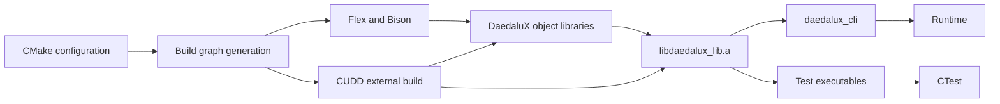

# DaedaluX build characterization

This document describes how the DaedaluX `baseline/2026-09` is configured, generated, compiled, linked, tested, and run. It records current behavior only; modernization proposals are outside its scope.

Findings are classified as:

- **OBSERVED** — directly supported by the repository or captured build output.
- **INFERRED** — interpretation derived from observations.
- **UNKNOWN** — not established by the current evidence.

## Baseline

- Tag: `baseline/2026-09`
- Commit: `130b3910d37a1939e3591be48d6c578a6958a37e`
- Environment: WSL Ubuntu 26.04, GCC 15.2, CMake 4.2.3, Ninja, Bison 3.8.2, Flex 2.6.4
- Configuration: Debug with `BUILD_TESTING=ON`

**OBSERVED:** The verbose build reached Ninja action `184/184` without a failure marker.

**UNKNOWN:** The command did not explicitly record its final return code.

## Build flow



No multi-target strongly connected component was identified in the reviewed CMake target graph. Source-level include dependencies have not yet been analyzed and may reveal relationships that CMake does not express.

## Principal targets

| Target | Purpose | Depends on | Produces |
|---|---|---|---|
| `promela_parser` | Generate the Promela parser and lexer | Flex, Bison/Yacc, `promela.l`, `promela.y` | `lex.yy.cpp`, `y.tab.cpp`, `y.tab.hpp` |
| `CUDD_project` | Build the vendored CUDD dependency | Autotools-compatible environment and Make | `libcudd.a` |
| `daedalux_core` | Compile core sources | `CUDD_project` | Object files |
| `daedalux_algorithm` | Compile algorithm sources | `CUDD_project` | Object files |
| `daedalux_feature` | Compile feature sources | `CUDD_project` | Object files |
| `daedalux_formulas` | Compile formula sources | `CUDD_project` | Object files |
| `daedalux_promela` | Compile Promela sources | `promela_parser`, `CUDD_project` | Object files |
| `daedalux_mutants` | Compile mutation sources | `CUDD_project` | Object files |
| `daedalux_visualizer` | Compile visualization sources | `CUDD_project` | Object files |
| `daedalux_lib` | Aggregate the implementation | Seven object libraries and CUDD | `libdaedalux_lib.a` |
| `daedalux_cli` | Provide the command-line interface | `daedalux_lib`, CUDD | CLI executable |
| Test executables | Run automated tests | `daedalux_lib`, CUDD, GoogleTest | CTest programs |

## Findings

### Configuration

- **OBSERVED:** The project requires C++20 and declares CMake 3.19 as its minimum version ([CMake configuration](https://github.com/samilazreg-eng/DaedaluX/blob/baseline/2026-09/CMakeLists.txt#L1-L16)).
- **OBSERVED:** Tests are enabled by default.
- **UNKNOWN:** The build has not been verified with the declared minimum CMake version.
- **UNKNOWN:** `BUILD_EXAMPLES` is declared, but its effect has not yet been established.

### Parser generation

- **OBSERVED:** Flex and Bison outputs are written into the source checkout ([parser rules](https://github.com/samilazreg-eng/DaedaluX/blob/baseline/2026-09/CMakeLists.txt#L18-L44)).
- **OBSERVED:** A clean out-of-source build regenerated `lex.yy.cpp`, `y.tab.cpp`, and `y.tab.hpp`.
- **OBSERVED:** `y.tab.hpp` is generated by Bison but is not declared as a CMake output or byproduct.
- **OBSERVED:** The generated files record machine-specific absolute source paths:

```diff
-#line 71 "/home/slazreg/Work/Research/daedalux/src/promela/parser/promela.y"
+#line 71 "/home/samil/Workspaces/DaedaluX/src/promela/parser/promela.y"
```

- **OBSERVED:** Bison reported deprecated directives, unused grammar elements, 65 shift/reduce conflicts, and 266 reduce/reduce conflicts.
- **UNKNOWN:** Why the checked-in generated files were considered stale on a clean checkout.
- **UNKNOWN:** Whether a second unchanged build correctly performs no parser-generation work.

### CUDD

- **OBSERVED:** CUDD is vendored and built as an external project ([CUDD rules](https://github.com/samilazreg-eng/DaedaluX/blob/baseline/2026-09/CMakeLists.txt#L47-L119)).
- **OBSERVED:** Its build uses `configure`, `make -j4`, a static `.a` archive, and Unix-style `.libs` paths.
- **OBSERVED:** The outer Debug build produced a CUDD configuration using `-g -O3`.
- **OBSERVED:** `CUDD::obj` and `CUDD::cudd` refer to the same `libcudd.a` archive, which consequently appears twice in final link commands.
- **INFERRED:** CUDD's build configuration and parallelism are controlled independently of the outer CMake build.
- **UNKNOWN:** Whether linking the same CUDD archive twice is necessary.

### DaedaluX library

- **OBSERVED:** Seven object-library targets compile approximately 95 implementation sources ([object libraries](https://github.com/samilazreg-eng/DaedaluX/blob/baseline/2026-09/CMakeLists.txt#L121-L188)).
- **OBSERVED:** Their objects are collected into the static `daedalux_lib` archive ([aggregate library](https://github.com/samilazreg-eng/DaedaluX/blob/baseline/2026-09/CMakeLists.txt#L190-L231)).
- **OBSERVED:** Sources are discovered with recursive globs without `CONFIGURE_DEPENDS`.
- **OBSERVED:** All seven object libraries depend on `CUDD_project`, but dependencies between the DaedaluX components are not expressed as target relationships.
- **INFERRED:** The object targets organize compilation; they do not currently form independently linkable component libraries.
- **INFERRED:** Sanitizer compile options attached only to `daedalux_lib` do not instrument implementation files already compiled by the object libraries.
- **UNKNOWN:** Which implementation groups actually use CUDD.

## What needs further attention

1. Explain why a clean checkout regenerates tracked parser files.
2. Verify incremental parser generation and declare every generated output.
3. Determine whether generated sources should contain absolute machine paths.
4. Identify the actual CUDD consumers and explain the duplicate archive linkage.
5. Verify the build with the declared minimum CMake version.
6. Verify source discovery after adding or removing implementation files.
7. Verify sanitizer coverage of the implementation objects.
8. Document GoogleTest acquisition, CTest registration, fixtures, and working-directory assumptions.
9. Document runtime dependencies such as SPIN and `ltl2ba`.
10. Review installation, package export, portability, and reproducibility assumptions.

These findings characterize the current build. They do not yet prescribe a replacement architecture or modernization plan.
