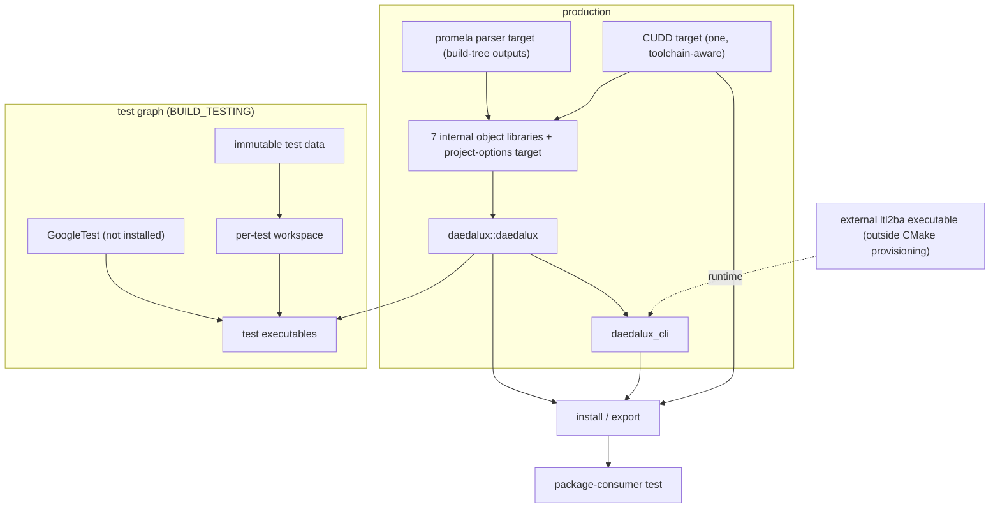
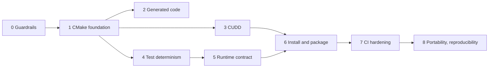

# DaedaluX build: diagnosis, target architecture and roadmap

This document turns the build characterization into a diagnosis, a target build architecture and a phased roadmap. It changes nothing in the build. Each phase item is meant to become one issue and one pull request.

It builds on six reports, all on `main`:

- [build-characterization.md](build-characterization.md) (#48)
- [parser-regeneration.md](parser-regeneration.md) (#61)
- [cudd-consumers.md](cudd-consumers.md) (#63)
- [cmake-minimum-version.md](cmake-minimum-version.md) (#64)
- [test-infrastructure.md](test-infrastructure.md) (#65)
- [install-package-portability.md](install-package-portability.md) (#67)

The scope is the build system, not the design of DaedaluX itself. Every step must leave `main` buildable and testable, and must change one concern at a time.

## 1. Diagnosis

The build works: a fresh clone configures, builds 35 executables and passes 121 of 146 tests. But most of what it depends on is not declared. CMake knows how to compile DaedaluX. It does not know who needs which dependency, which files are generated, what the tests and binaries need at run time, or what the installed package must contain. That knowledge lives in ambient state instead: `PATH`, the working directory, the source-tree layout, absolute paths, directory-wide include paths, shared mutable test files and compiler defaults.

| Concern | What was observed | Report | Issues |
|---|---|---|---|
| Configure | Configure checks only for a C++ compiler (`project(... LANGUAGES CXX)`). Without `flex` or `yacc` it returns 0 and the build fails (rc 127). CUDD's C compiler, `make` and `sh` are never checked. CUDD's own `configure` picks `gcc` at build time. No runtime tool is reported. | install, parser-regeneration | #82, #83 |
| Module targets | Seven object libraries, no dependencies declared between them. `daedalux_lib` has no sources of its own, so the `ENABLE_SANITIZERS` compile flags set on it instrument nothing. The project sets no warning flags. `BUILD_EXAMPLES` is declared and used nowhere. | characterization | — |
| Source discovery | Recursive globs without `CONFIGURE_DEPENDS`. A new test source is neither built nor registered until the next configure. | test-infrastructure | #88 |
| Generated parser | Every new Ninja build directory rewrites the tracked `lex.yy.cpp`, `y.tab.cpp` and `y.tab.hpp`. Only absolute paths change. `y.tab.hpp` and `lexer.h` are undeclared outputs. Flex writes `lexer.h` into the build directory while the compiler reads a stale tracked copy. Configure does not look for `flex` or `yacc`. | parser-regeneration | #33, #82 |
| CUDD | 13 of 95 library objects use CUDD, but all seven modules wait for its build and every target, GoogleTest included, gets its eight include paths. Two imported targets name one archive, so it is linked twice. Only `tvl.cpp` needs CUDD's generated `config.h`, through `cuddInt.h`. CUDD is built with `gcc -g -O3` whatever compiler and build type are selected. `bootstrap_cudd` is unused. | cudd-consumers, install | #26, #83 |
| CUDD in the API | 30 of 144 public headers reach `cuddObj.hh`, and CUDD types appear in signatures and data members, `core/automata/fsm.hpp` included. CUDD cannot become a private dependency without an API change. | cudd-consumers | — |
| GoogleTest | Cloned by tag at the first configure (fails offline). GoogleMock is built but unused. Both are installed and packed with DaedaluX. | test-infrastructure, install | #80 |
| `BUILD_TESTING=OFF` | Configure fails on every CMake version: `CMakePackageConfigHelpers` is never included and only GoogleTest's own build includes it. | cmake-minimum | #71 |
| Test isolation | Each case runs in its own process, but 136 of 146 run in one shared `test_fixtures` copy and write into it. 11 committed fixtures are rewritten in place. `flows.pml` and `array_mutant.pml` have been emptied under `ctest -j` and stayed empty until the next configure. No timeout, no label. The `tests/**/CMakeLists.txt` files are never used. | test-infrastructure, cmake-minimum | #72, #86, #87, #88, #44, #5 |
| Runtime tools | `cpp` and `spin` from `PATH`. `ltl2ba` from `<cwd>/../src/bin`, where the tracked binary is aarch64. `TVLParser.jar` from `./libs/tvl`. The library calls `exit(1)` when `cpp` is missing. The `ltl2ba` lookup alone causes 14 of the 25 baseline failures. | test-infrastructure, install | #22, #41, #21 |
| Package | `cmake --install` succeeds, but `find_package(daedalux)` fails: the export links `CUDD::obj;CUDD::cudd`, which the package neither installs nor defines. The C++20 requirement is not exported (11 headers fail under C++17). `daedalux.hpp` includes `Visualizer.hpp` (wrong case). Two headers miss a standard include. CLI11 is installed as a DaedaluX header. CPack settings come after `include(CPack)` and are ignored. | install, cudd-consumers | #77, #78, #79, #81, #47 |
| Declared vs. executed | CI builds and tests only on `alpha`, so it never runs on `main`. Its `gcc`/`clang` matrix never selects the compiler, it runs `ctest --parallel` without a timeout. Presets need CMake 3.21, the project declares 3.19 and the README says 3.16. The README promises macOS and lists Boost and GMP, which are unused. The Docker scripts point to missing paths, and the dev container installs `byacc`. | cmake-minimum, install | #10, #70, #73, #74, #46, #84, #85 |

What was verified: Linux x86-64 (WSL Ubuntu 26.04), GCC 15.2 for build and tests, Clang 21.1.8 for the build only, CMake 3.19.0 to 4.2.3.

Not established by the reports, and relied on below only where stated:

- source-level dependencies between the seven modules;
- the Clang test results;
- macOS and Linux ARM64;
- the sanitizer build itself. The claim above comes from reading `CMakeLists.txt`. No sanitizer build was run.

## 2. Target invariants

The modernization is finished when these hold. Each phase below moves one or more of them from false to true.

1. **Targets carry requirements.** Include paths, compile features, definitions, options and link dependencies are attached to targets. There is no directory-wide configuration. Developer options such as warnings and sanitizers stay private to DaedaluX targets.
2. **Every dependency has one owner.** Each external dependency is one target, attached only to its real consumers.
3. **The build never writes into the checkout.** Every generated file is a declared output in the build tree.
4. **Tests are hermetic.** Each test reads immutable inputs and writes only to its own directory. Serial and parallel runs give the same result.
5. **Runtime lookups are explicit.** No binary derives a tool or data location from the working directory or the repository layout.
6. **The install is a tested interface.** A clean project can `find_package(daedalux)`, build and run against the installed prefix alone. The prefix contains no test dependency.
7. **Anything declared is executed.** Every configuration, platform and CMake version that the repository claims (README, presets, CI matrix) is exercised by CI.
8. **Configure is the first gate.** If configure succeeds, the build does not fail for a missing tool or library. Configure ends with a summary of what was found and what is unavailable.

## 3. Dependency model

The D7/D10 and external-runtime test policies below reflect the maintainer's decisions of 2026-10-10. Diagnosis, historical inventory observations, and measured test counts remain characterization evidence, not new findings.

### 3.1 Classes

A dependency is classified by the phase that needs it. One dependency can belong to several classes.

| Class | Needed to | Missing at configure |
|---|---|---|
| Build | turn sources into artifacts (Flex, Bison, CUDD's build machinery). Neither linked in nor needed on the machine that runs DaedaluX | configure fails |
| Compile/link | compile or link a target, through headers, symbols or usage requirements (CUDD). `PUBLIC` when the requirement reaches consumers | configure fails |
| External runtime | run a built binary (`cpp`, `ltl2ba`, `spin`, `gcc`, `java`). Needed on the machine that runs DaedaluX, which may not be the build machine | FeatureSummary reports availability nonfatally, including with `BUILD_TESTING=ON` |
| Provided runtime resource | support runtime functionality with resources supplied by DaedaluX (`TVLParser.jar`) | availability reported; provided in build-tree resources in Phase 5; use-time absence produces a recoverable error |
| Test | build the tests (GoogleTest) or run them (test data and runtime tools) | required test build dependencies may fail configure when `BUILD_TESTING` is on; external runtime absence never does. Affected mandatory-runtime tests fail explicitly; tests explicitly conditional on optional capabilities may skip with visible diagnostics |
| Package | install and package (export helpers, CPack generators) | configure fails for install and export rules. Unavailable CPack generators are reported |

CUDD shows why the classes must stay apart. Its autotools build is a build dependency. Its archive and its C++ wrapper headers are a `PUBLIC` compile/link dependency, because CUDD types appear in DaedaluX's public headers. A consumer of the installed package needs the second but not the first. Flex and Bison are the opposite case: build-only, so a package user never needs them.

### 3.2 Inventory

The runtime entries come from every `system()` and `popen()` call in `src/` and `include/`, outside the vendored libraries. [runtime-dependency-characterization.md](runtime-dependency-characterization.md) identifies each of them: what it is used for, where the code calls it, and how it is located.

| Dependency | Class | Used by | Today | Target at configure |
|---|---|---|---|---|
| C++20 compiler | build | everything | checked | checked, and exported as `cxx_std_20` |
| C compiler, `make`, `sh` | build | CUDD | not checked. CUDD's `configure` picks `gcc` itself | enable C in `project()`, `find_program(make REQUIRED)`, and pass both compilers to CUDD |
| Bison, Flex | build | Promela parser | not checked. The build fails with rc 127 | `find_package(BISON/FLEX REQUIRED)` |
| CUDD 3.0.0 (vendored) | build + public link | 13 library objects, public headers | always present | always present. Exported per D5 |
| GoogleTest | test (fetched) | test executables | fetched at the first configure, fails offline | fetched or found when `BUILD_TESTING` is on (phase 4) |
| `CMakePackageConfigHelpers` | package | export | only included by GoogleTest's build (#71) | included by the project |
| `cpp` | runtime + test | every model load (`promela_loader.cpp:95`) | `PATH` at run time. The library calls `exit(1)` when it is missing | reported nonfatally, including with testing enabled. Tests requiring missing `cpp` fail explicitly |
| `ltl2ba` | runtime + test | LTL to never claim (`ltl.cpp:28`) | `<cwd>/../src/bin`, aarch64 binary | external per D7, reported nonfatally. Missing `ltl2ba` does not fail configure or build; affected LTL tests fail explicitly |
| `spin` | runtime + test | `spinRunner.cpp:40, 68` (`spin -V`, `spin -run`) | `PATH` at run time | reported nonfatally. Tests explicitly conditional on optional SPIN may skip with visible diagnostics (#41); absence is not a model-checking verdict |
| C compiler at run time | runtime | `spin -run` compiles and runs a verifier | never considered | reported with SPIN. INFERRED from SPIN's `-run` behaviour, not observed: SPIN is not installed here |
| `java` | external runtime | `tvl.cpp:74` | from `PATH` | availability reported nonfatally; checked at TVL use time |
| `TVLParser.jar` | provided runtime resource | `tvl.cpp:74` | from `./libs/tvl`, tracked under `src/libs/tvl` | available in build-tree resources in Phase 5, with explicit location-independent lookup; installation belongs to Phase 6 |
| `owl` | none today | `formulaSimplifier.hpp:32` | a `which owl` check. The call itself is commented out | not a dependency. Remove the check or document it |

Graphviz is not a dependency: DaedaluX writes `.dot` files and never runs `dot`. The only `std::thread` use is commented out, so there is no threads dependency either.

### 3.3 Configure as a gate

Configure answers one question before it generates the build graph: can this configuration be built here? It fails when a required build, compile/link, enabled-test build, or package dependency is missing. External runtime tools are a separate class even when tests need them; their absence does not make configure fatal.

External runtime dependencies follow a different rule. Configure runs on the build machine, and a binary may run elsewhere. FeatureSummary reports external runtime availability nonfatally, including with `BUILD_TESTING=ON`; use-time lookup and availability checks remain necessary. Tests requiring an unavailable mandatory runtime dependency, including `cpp` or `ltl2ba`, fail explicitly rather than produce false successes. Tests explicitly conditional on optional capabilities may skip with visible diagnostics. Missing SPIN must not be confused with a model-checking verdict. Missing `ltl2ba` does not prevent configuring or building DaedaluX.

Each target declares its actual runtime requirements distinctly from build and compile/link dependencies. Acquisition and use are separate responsibilities. Runtime lookup is explicit and independent of the current working directory, source-tree layout, and absolute build-directory location. Missing dependencies produce recoverable errors when the affected functionality is used; optional-capability absence leaves unrelated functionality usable.

D10 keeps LTL translation a required product capability and SPIN/TVL optional. Required product capability does not require its external tool at configure time. No new build options are introduced solely because a runtime tool is missing.

### 3.4 Summary

CMake's standard modules do this without project-specific code:

- `find_package(... REQUIRED)` for Bison and Flex, which are build dependencies with find modules;
- external runtime tools, including Java and `ltl2ba`, reported nonfatally through FeatureSummary;
- `find_program(... REQUIRED)` (CMake 3.18) for `make`;
- `set_package_properties(... TYPE REQUIRED|OPTIONAL|RUNTIME PURPOSE ...)` and `add_feature_info()` for the classes and capabilities;
- `feature_summary(WHAT ALL FATAL_ON_MISSING_REQUIRED_PACKAGES)` to print the report and stop on a missing required build/link/package or enabled-test build dependency, without making external runtime absence fatal.

The report ends every configure log, in CI too, and can be pasted into issues. It lists:

- the enabled capabilities (Promela parser, CUDD, tests, LTL translation, SPIN, TVL, packaging);
- the required packages found, with their versions;
- the runtime tools found or missing.

It is FeatureSummary's standard layout, not a hand-written one.

## 4. Decisions required

These choices are the maintainer's. D7 and D10 below are established decisions as of 2026-10-10; unrelated decision entries are retained. Each decision governs the items that name it in the roadmap.

| # | Decision | Options | Recommendation |
|---|---|---|---|
| D1 | Deliverables | (a) CLI only; (b) CLI and library | (b), with the library advertised as supported only once the package-consumer test of phase 6 passes. Only the CLI works from an install today. |
| D2 | First platform contract | Linux x86-64 with GCC; add Clang; add macOS, ARM64 | Linux x86-64, GCC and Clang, once CI really selects the compiler. Remove macOS from the README until CI runs it. |
| D3 | CMake minimum (#70) | (a) document that presets need 3.21; (b) presets `"version": 2` (needs 3.20); (c) raise to 3.21 | (c). Revisit if the roadmap adopts `FILE_SET` header installs (3.23) or workflow presets (3.25). Ubuntu 22.04 ships 3.22, so 3.25 would drop its system CMake. |
| D4 | Tracked parser outputs (#33) | (a) untrack and generate in the build tree; (b) keep as an explicit fallback | (a). The README already requires Flex and Bison. The Ninja build never uses the tracked copies. The regenerated files match them after path normalization. |
| D5 | CUDD in the installed package | (a) install the vendored `libcudd.a` and headers, and define the target in `daedaluxConfig.cmake`; (b) require consumers to provide CUDD 3.0.0 with its C++ wrapper; (c) remove CUDD from the public headers | (a) now. (c) is an API change and is deferred (section 8). Name the installed target inside the project namespace (for example `daedalux::cudd`), so that it cannot clash with a consumer's own CUDD. |
| D6 | Exported library name | keep `daedalux::daedalux_lib`; rename to `daedalux::daedalux` | Rename. No consumer can use the package today, so the rename breaks nobody. |
| D7 | Runtime provisioning | Established: fully external `ltl2ba`; developer-invoked standalone script | DaedaluX CMake does not download, compile, stage, or install `ltl2ba`. Standalone `scripts/install-ltl2ba.sh` is planned Phase 5 work under #153; once implemented, the developer will invoke it explicitly, independently of CMake, to download an official upstream source archive, compile it, and install the executable in the developer's environment. It is never an implicit CMake dependency. Availability is reported nonfatally; location and availability are resolved at LTL use time, with recoverable errors. `spin`, `cpp`, `gcc`, and `java` remain external; `TVLParser.jar` is provided in build-tree resources. |
| D8 | Source lists | explicit lists; globs with `CONFIGURE_DEPENDS` | Explicit lists, the form CMake recommends. `CONFIGURE_DEPENDS` is the smaller change if the maintainer prefers it. |
| D9 | Parallel tests until phase 4 | serial `ctest`; `RESOURCE_LOCK` | Serial. `RESOURCE_LOCK` was already declined during the baseline phase. Serial runs are deterministic: 121 / 146 every time. |
| D10 | Runtime capability contract | Established: LTL translation required; SPIN and TVL optional | Required product capability does not require external-tool availability at configure time. Missing tools are checked when needed and produce recoverable errors; unrelated functionality remains usable when optional capabilities are unavailable. No new build options are introduced solely because a runtime tool is missing. |

## 5. Target architecture

**Configure.** Configure declares every dependency of section 3 with its class and actual consuming targets, and prints FeatureSummary. Required build/link/package and enabled-test build dependencies retain their configure gate. External runtime absence is nonfatal, including with `BUILD_TESTING=ON`.

**Layout.** The top-level `CMakeLists.txt` only orchestrates: options, dependencies, `add_subdirectory(src)`, `add_subdirectory(tests)` when `BUILD_TESTING` is on, then install and packaging. Helper modules under `cmake/` hold the options, CUDD, and packaging. The exact split does not matter, as long as each concern has one owner. The unused `tests/**/CMakeLists.txt` files are replaced, not revived as they are: they assume an installed DaedaluX.

**Modules.** The seven object libraries stay internal. They get their own sources (D8), their own include requirements and their own external dependencies. A small `INTERFACE` project-options target gives them the same warnings and sanitizers, which fixes the sanitizer gap. Splitting them into public libraries needs a source-level dependency analysis and is deferred (section 8).

**C++ standard.** `target_compile_features(daedalux PUBLIC cxx_std_20)` replaces the reliance on `CMAKE_CXX_STANDARD` for consumers.

**Parser.** `find_package(BISON)` and `find_package(FLEX)` at configure time. `bison` is invoked by name, not `yacc`, because `yacc` may be `byacc`. All four outputs, including `y.tab.hpp` and `lexer.h`, are declared and written under the build tree.

**CUDD.** One imported target that carries the public include directories (`cudd`, `cplusplus`). The internal directories stay private to the one source that needs them, or disappear once `tvl.cpp` uses `Cudd_ReadStdout` and `Cudd_SetStdout` instead of writing `DdManager::out`. The external build receives the project's compilers and flags. CUDD stays a public dependency, and the package represents it as D5 decides.

**Tests.** Test-only dependencies stay in the test graph. Every test gets a label (`unit`, `integration`), a timeout and a private working directory created from immutable data. Inputs are located through a path given by CMake, not through `current_path()`.

**Install.** `GNUInstallDirs`, a complete export (C++20, CUDD per D5), `include(CMakePackageConfigHelpers)`, and no GoogleTest. `CPACK_*` variables are set before `include(CPack)`. A small consumer project under `tests/package-consumer/` is configured against the installed prefix in CI.

**Presets and CI.** `CMakePresets.json` is the single definition of the supported configurations: at least `debug`, `release` and `asan-ubsan`. CI selects presets and the compiler. It does not rebuild the configuration from its own command lines.

## 6. Roadmap

Phases 2, 3 and 4 do not depend on each other and can overlap.

### Phase 0: guardrails

**Objective:** tell intended change from regression automatically, from the first modernization PR on.

1. Record the baseline: 121 / 146 serial on `main`. The 25 failures are 14 × `ltl2ba` (#22), 6 × #39, 2 × #40, 2 × #41 (SPIN missing) and 1 × #35.
2. Take D1, D2 and D9.
3. Minimal CI on `main` and its PRs (#10). GCC and Clang are really selected (`CC`/`CXX` or presets). The job runs `ctest --timeout 120` serially and fails on any result other than the recorded baseline. For example, it excludes the 25 known failures by name, each exclusion citing its issue and removed when the issue is fixed.

**Exit:** every later PR is checked by CI against the baseline.

CI comes first on purpose. Phases 1 to 6 are refactorings, and they need a regression check from the start. The strict gates (parallel tests, sanitizers, `-Werror`) stay in phase 7, after test isolation.

### Phase 1: CMake foundation

**Objective:** compile configuration flows through targets.

1. Include `CMakePackageConfigHelpers` (#71). This is a one-line fix, and it lets CI check `BUILD_TESTING=OFF` from here on.
2. Align the CMake minimum with D3 (#70). Correct the README (#74).
3. Export `cxx_std_20` as a `PUBLIC` compile feature (#78).
4. Add the project-options target (warnings and sanitizers) and apply it to the object libraries, the CLI and the tests. Verify with an `ENABLE_SANITIZERS=ON` build that library objects are instrumented.
5. Remove the unused `BUILD_EXAMPLES` option.
6. Move ownership into `src/CMakeLists.txt` and `tests/CMakeLists.txt`, with explicit sources per D8. For the tests, this also replaces the unused `tests/**/CMakeLists.txt` (#88).
7. Add the configure summary (section 3.4) with the dependencies known today. Later phases register theirs as they declare them.

**Exit:** no directory-wide compile setting remains except CUDD's include paths, which phase 3 removes. Every configure log ends with the dependency summary.

### Phase 2: generated code (D4, #33)

1. Find Bison and Flex at configure time, as `REQUIRED` build dependencies, and invoke `bison` explicitly (#82). Configure then fails where the build used to fail with rc 127.
2. Generate all four outputs in the build tree and declare them.
3. Remove the tracked `lex.yy.cpp`, `y.tab.cpp`, `y.tab.hpp` and `lexer.h`. Equivalence is already shown in parser-regeneration.md.
4. Check a clean build, a no-op rebuild, and a rebuild after touching `promela.y` or `promela.l`.

**Exit:** `git status` is clean after any build, and deleting the build directory is enough to regenerate everything.

### Phase 3: CUDD

1. Replace `CUDD::obj` and `CUDD::cudd` with one target, and drop the CLI's redundant CUDD items. Expected: one archive per link line, byte-identical executables.
2. Move the include paths from `include_directories` to the target, and remove the global call.
3. Replace the `DdManager::out` writes in `tvl.cpp` with the public accessors. This is a source change in the library, so it gets its own PR. Then reduce the seven compile-order dependencies on `CUDD_project` to the link.
4. Enable C in `project()`, check for `make` at configure time, and pass the project's compilers and build type to CUDD's `configure` (#83).
5. Remove `bootstrap_cudd`. Handle the committed CUDD build artifacts (#26).

**Exit:** the build graph states exactly which targets use CUDD, and a Clang build compiles CUDD with Clang.

### Phase 4: test determinism

1. GoogleTest: pin it by commit hash, set `INSTALL_GTEST OFF` and `BUILD_GMOCK OFF`, and document the offline route (`FETCHCONTENT_SOURCE_DIR_GOOGLETEST`) (#80).
2. Add labels and timeouts to every test (#88).
3. Give each test a private workspace created from immutable data, and locate the data through a CMake-provided path. This fixes #72, #44 and the 11 fixtures rewritten in place (#86). Refresh the data at build time, not only at configure time, and stop copying the unused 28 MB of `models/` (#87).
4. Remove the fixed temporary names in `ltl.cpp` (`__formula.tmp`, the `ltl.cpp` part of #5).
5. Resolve externally installed `ltl2ba` explicitly for LTL tests per D7 (#22); #153 owns the standalone developer-invoked installation script, outside CMake. Missing `ltl2ba` does not fail configure or build; affected LTL tests fail explicitly. Lookup validation must land with or after item 4: historical reports found 20 of 20 parallel runs failed with `ltl2ba` found and `__formula.tmp` still shared.
6. Declare the tools the tests run and report availability nonfatally, including with `BUILD_TESTING=ON` (#139). Missing `cpp` does not fail configure; affected mandatory-runtime tests fail explicitly. Tests explicitly conditional on optional SPIN may skip with visible diagnostics (#41); missing SPIN must not become a model-checking verdict.
7. Remove the tracked root `CTestTestfile.cmake` and `DartConfiguration.tcl`, and the stale `run_tests.py` (#85).

**Exit:** repeated serial and `ctest -j` runs give the same named outcomes for the same tool availability, and no run changes the test data. Missing mandatory runtime tools produce explicit affected-test failures; only tests explicitly conditional on optional capabilities may skip with visible diagnostics. Historical reports recorded a rise from 121 to 135 / 146 once `ltl2ba` was supplied, and two SPIN failures without SPIN; those measurements are evidence, not current acceptance totals.

### Phase 5: runtime contract (D7, D10)

**Input:** [runtime-dependency-characterization.md](runtime-dependency-characterization.md) preserves the baseline runtime calls and locations. Current D7/D10 and test policy supersede earlier provisioning/configure recommendations, without changing those historical observations.

**Scope:** build-tree runtime execution and the standalone developer-environment provisioning contract only. DaedaluX installation, packaging, exported targets, and installed-prefix validation remain Phase 6.

1. Resolve external `ltl2ba` location and availability explicitly when LTL translation is invoked (#22). #153 will provide standalone `scripts/install-ltl2ba.sh`, to be explicitly invoked by the developer to download official upstream source, compile it, and install the executable in the developer's environment independently of CMake. CMake must not download, compile, stage, or install `ltl2ba`, or invoke the script implicitly. Locate the provided TVL JAR from build-tree resources independently of launch directory, source layout, and absolute build location; remove `./libs/tvl`-style lookups.
2. Report a missing `cpp`, `spin`, `gcc`, `java`, `ltl2ba`, or required TVL resource as a recoverable error the caller can handle, instead of terminating the consumer inside the library. The check happens when the tool is needed, not only at configure time, because the binary may run on another machine.
3. Remove or document the `which owl` check.
4. Stop writing `fsm_graphvis` and similar debug output into the working directory (#15).
5. Declare runtime requirements against their actual consuming targets and report availability through FeatureSummary nonfatally, including with testing enabled. Missing `ltl2ba` does not prevent configuring or building. No new build options are introduced solely because a runtime tool is missing.

**Exit:** the CLI and relevant tests resolve runtime tools/resources independently of launch directory, source-tree layout, and absolute build location. Missing dependencies yield recoverable use-time errors; optional-capability absence leaves unrelated functionality usable. Tests requiring missing mandatory runtime tools fail explicitly, while tests explicitly conditional on optional capabilities may skip with visible diagnostics.

### Phase 6: install and package (D1, D5, D6)

DaedaluX installation, packaging, exported CMake targets, and installed-prefix validation belong here. The developer's external `ltl2ba` installation through D7's standalone script is independent of DaedaluX CMake and is not DaedaluX package installation.

1. `GNUInstallDirs`. Export the library under the D6 name, with its C++20 requirement (#78) and CUDD as D5 decides (#77).
2. Fix `daedalux.hpp` (`visualizer.hpp`, #79) and the missing `<cstdint>` and `<stdexcept>` includes (#78). Compile every public header on its own in CI.
3. Decide whether CLI11 belongs in the public headers. Today it is installed as `daedalux/CLI11.hpp`.
4. Set `CPACK_*` before `include(CPack)` (#81), and choose the generators and build type of the archives.
5. Add the package-consumer test: install, configure a clean project against the prefix, build, run, and repeat after moving the prefix.
6. Align the README's install and prebuilt-archive sections (#47).

**Exit:** `install → find_package → build → run` works without the DaedaluX build tree.

### Phase 7: CI hardening

1. Build through presets, Debug and Release.
2. Add an ASan/UBSan job, and a warnings policy with `-Werror` on one controlled configuration.
3. Run `ctest` in parallel, now that phase 4 makes it safe.
4. Add jobs for `BUILD_TESTING=OFF`, the declared minimum CMake (#73) and the package consumer.
5. Fix or remove the Docker scripts, the dev container (`byacc`) and `scripts/ci/bootstrap.sh` (#84, #46).
6. Keep test logs and `compile_commands.json` as artifacts.

**Exit:** every configuration the repository advertises is run by CI.

### Phase 8: portability and reproducibility

These wait until D2 is extended, and they block none of the phases above:

- macOS and Linux ARM64;
- path-independent binaries (`-ffile-prefix-map` for DaedaluX and CUDD, relative `#line` names in the parser);
- a fully offline configure;
- cross compilation and other package formats;
- the POSIX and LP64 assumptions (#14).

## 7. Follow-up issues

### Opened

These issues came from the reports' proposals. The roadmap phase says where each one lands.

| Issue | Severity | Subject | Phase |
|---|---|---|---|
| #70 | S3 | Presets need CMake 3.21, the project declares 3.19 (D3) | 1 |
| #71 | S2 | `-DBUILD_TESTING=OFF` fails: `CMakePackageConfigHelpers` never included | 1 |
| #74 | S4 | README lists CMake ≥ 3.16 | 1 |
| #78 | S3 | Exported library does not require C++20, and two public headers miss standard includes | 1, 6 |
| #88 | S3 | Test registration: no timeout, no labels, glob without `CONFIGURE_DEPENDS`, unused `tests/**/CMakeLists.txt` | 1, 4 |
| #82 | S3 | Configure does not check for Bison and Flex | 2 |
| #83 | S3 | CUDD is built with its own compiler and flags | 3 |
| #72 | S2 | MutantGenerationTest Flows cases rewrite a shared fixture | 4 |
| #86 | S2 | Tests rewrite committed fixtures in place, and a fixture can be emptied under `ctest -j` | 4 |
| #87 | S3 | Fixture lifecycle: refreshed only by configure, output accumulates, 28 MB unused | 4 |
| #80 | S3 | GoogleTest: network at configure, pinned by tag, installed with DaedaluX | 4 |
| #85 | S4 | Remove the tracked `CTestTestfile.cmake`, `DartConfiguration.tcl` and `run_tests.py` | 4 |
| #77 | S2 | `find_package(daedalux)` fails: CUDD targets neither installed nor defined (D5) | 6 |
| #79 | S3 | `daedalux.hpp` includes `Visualizer.hpp` (wrong case) | 6 |
| #81 | S3 | CPack settings are ignored | 6 |
| #73 | S3 | Build and test with the declared minimum CMake in CI | 7 |
| #84 | S3 | Docker scripts reference files that do not exist | 7 |

The reports' evidence was also added as comments on existing issues:

- #5: the tests reach `__formula.tmp` once `ltl2ba` is found;
- #10: the CI matrix never selects the compiler;
- #15: 61 cases write `fsm_graphvis`;
- #22: the committed `ltl2ba` is aarch64 and causes 14 of the 25 baseline failures.

Existing issues the roadmap also relies on: #5, #10, #15, #21, #22, #26, #33, #41, #44, #46, #47.

### Proposed by the reports, not opened

| Source | Proposal | Phase | Note |
|---|---|---|---|
| parser-regeneration 1 | Decide the role of the tracked generated files | 2 | D4. Extends #33 |
| parser-regeneration 2 | Declare `y.tab.hpp` and `lexer.h` as outputs | 2 | |
| parser-regeneration 3 | Write the Flex header beside the lexer, or stop tracking it; the tracked `lexer.h` is stale | 2 | Could merge with 2 |
| parser-regeneration 4 | Remove absolute paths from generated sources | 8 | |
| parser-regeneration 5 | Check other Flex and Bison versions, and the Makefiles timestamp race on other file systems | 8 | Investigation |
| cudd-consumers 1 | Replace `CUDD::obj` and `CUDD::cudd` with one target, and drop the CLI's duplicate items | 3 | |
| cudd-consumers 2 | Move CUDD's include paths from `include_directories` to the target | 3 | |
| cudd-consumers 3 | Use `Cudd_ReadStdout`/`Cudd_SetStdout` in `tvl.cpp` and drop `cuddInt.h` | 3 | Library source change |
| cudd-consumers 4 | CUDD in the public API and the package export | 6 | Covered by #77 |
| cudd-consumers 5 | Remove the unused `bootstrap_cudd` target | 3 | |
| cudd-consumers 6 | Verify the link on macOS | 8 | Waits for D2 |

### New in this roadmap

| Proposal | Severity | Phase |
|---|---|---|
| Minimal CI on `main`: real GCC/Clang selection, serial `ctest`, baseline gate | S2 | 0 (extends #10) |
| `ENABLE_SANITIZERS` instruments nothing (flags on a target without sources). Add a project-options target with warnings and sanitizers | S3 | 1 |
| Configure dependency summary with FeatureSummary (section 3.4) | S3 | 1 |
| Remove the unused `BUILD_EXAMPLES` option | S4 | 1 |
| Enable C in `project()` and check for `make` for the CUDD build | S3 | 3 (could join #83) |
| Declare runtime tools used by tests: nonfatal configure reporting, explicit affected-test failures for missing mandatory `cpp`/`ltl2ba`, visible skips only for tests conditional on optional capabilities | S3 | 4 (#139, with #41) |
| The library calls `exit(1)` when `cpp` is missing, so a consumer process cannot handle it | S3 | 5 |
| Remove or document the `which owl` check | S4 | 5 |
| Vendored CLI11 installed as `daedalux/CLI11.hpp` | S3 | 6 |
| README declares macOS and lists Boost and GMP, which are unused | S4 | 6 (with #47) |
| Dev container installs `byacc` instead of Bison | S3 | 7 (could join #84) |
| CI jobs for the package consumer and for compiling each public header on its own | S3 | 7 |

The severities are proposals on the S0–S4 scale. Decisions D1–D10 are not issues. They are taken on this document, and each one unblocks the items that name it.

## 8. Deferred architecture decisions

- **Hiding CUDD from the API.** Making CUDD private needs a redesign of the public headers that expose `ADD`, `BDD` and `Cudd`. The build first represents the current dependency correctly (phase 3 and D5).
- **Splitting `daedalux_lib`.** Whether `core`, `promela`, `feature` or `algorithm` should become separately linkable needs a source-level dependency analysis, which none of the reports has done. The build should reveal the architecture, not invent it.

## 9. Outcome

A DaedaluX configuration is fully described by its declared targets, dependencies and supported presets. A clean checkout can be configured, built, tested, installed and consumed, on every platform CI covers. It no longer depends on the repository layout, on shared mutable state, or on whatever the environment happens to provide.
